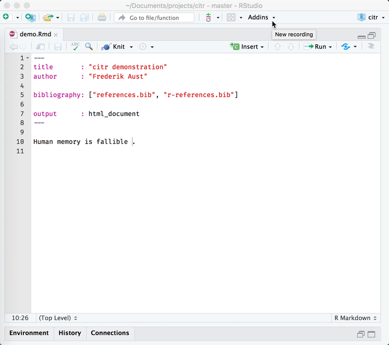

citr: RStudio Addin to Insert Markdown Citations
================

[](https://cran.r-project.org/package=citr) [](https://cran.r-project.org/package=citr) [](http://www.repostatus.org/#active) [](https://travis-ci.org/crsh/citr)

`citr` provides functions and an [RStudio addin](https://rstudio.github.io/rstudioaddins/) to search a BibTeX-file to create and insert formatted Markdown citations into the current document.

Installation
------------

You can either use the stable version of `citr` from CRAN,

``` {r}
install.packages("citr")
```

or the current development snapshot from this GitHub repository:

``` {r}
devtools::install_github("crsh/citr")
```

How to use citr
---------------

### The RStudio addin

Once `citr` is installed and you have restarted your R session, the addin appears in the menus. Alternatively, you can define a [keyboard shortcut](https://rstudio.github.io/rstudioaddins/#keyboard-shorcuts) to call the addin.



The addin will automatically look up the Bib(La)TeX-file(s) specified in the YAML front matter. If the document does not contain a YAML front matter the addin will attempt to locate a parent document and look up the Bib(La)TeX-file specified therein. That is, the addin works its automagic even if you edit R Markdown documents that are included as [children](http://yihui.name/knitr/demo/child/) in another R Markdown document. The expected names of a parent document default to `c("index.Rmd", "master.Rmd")`, it thus works with [`bookdown`](https://bookdown.org/) out of the box, but can be customized (e.g., `options(citr.parent_documents = "my_parent.Rmd")`).

### Using citr without RStudio

The following call searches a Bib(La)TeX-file and creates formatted Markdown citations for the results.

``` {r}
library("citr")
md_cite("foo 2016", bib_file = "references.bib")
```

`md_cite()` searches the author, year, title, and journal fields of your references.

### Better Bib(La)TeX integration

If you are using Zotero or Juris-M `citr` can access your reference database directly. For this to work, you need to install the [Better Bib(La)TeX extension](https://github.com/retorquere/zotero-better-bibtex/wiki), which I would recommend anyway. Once the extension is installed and your reference manager is running, `citr` will automatically access all your references and keep your Bib(La)Tex-file updated by adding missing references. If you dislike this behavior, you can disable it by setting `options(citr.use_betterbiblatex = FALSE)`.

Known problems
--------------

`citr` relies on `RefManager::ReadBib()` and, thus, indirectly on `bibtex::read.bib()` to load bibliographies.

-   I have noticed that very long Bib(La)Tex files can cause the underlying functions to fail (e.g., `Error: lex fatal error: fatal flex scanner internal error--end of buffer missed`). A restart of the R session may be necessary to resolve the issue.

-   Currently, a [bug](https://github.com/mwmclean/RefManageR/issues/16) in `tools::latexToUtf8()` can cause `RefManager::ReadBib()` to hang and never finish. This problem has been worked around in the development version of `RefManager` (&gt; 0.10.13). If you experience problems like this, try installing `RefManager` [from GitHub](https://github.com/mwmclean/RefManageR).

Other RStudio addins
--------------------

If you are interested in other handy addins take a look at this [list](https://github.com/daattali/addinslist#readme). There you can find other useful addins, such as [rcrossref](https://github.com/ropensci/rcrossref) or [wordcountaddin](https://github.com/benmarwick/wordcountaddin).

Package dependencies
====================

    ## Warning: Ignoring unknown parameters: segment.color


